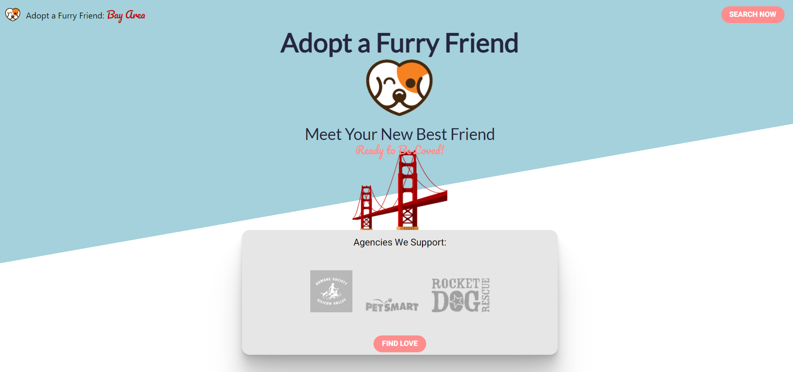
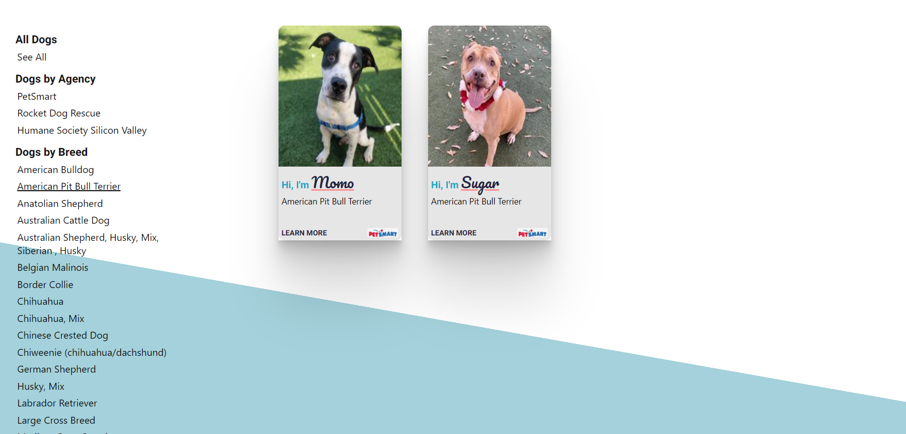

# AdoptAFurryFriend :dog:

## Description of Site
"Adopt a Furry Friend" is a Node.js application to help those in the Bay Area find their new best friend (doge)! 

The site was built with data (dog information) scraped from three dog adoption agency sites in the Bay Area (Petsmart, Rocket Dog Rescue, and Humane Society of Silicon Valley) using Cheerio (node package). 

## Pictures of Site
[Click here to visit site](https://adopt-a-furry-friend.herokuapp.com/)

**Initial home page:**


**Seeing dogs by adoption agency or by breed:**


## Getting Started
These instructions will help get you a copy of the project up and running on your local machine for development and testing purposes. 

### Prerequisites 
What you will need to install before running this application:

1. [NODE](https://nodejs.org/en/download/)
2. [NPM](https://docs.npmjs.com/cli/install)

Once the above are installed, install server dependencies:
```
# open a new shell and navigate to AdoptAFriend directory
$ npm i
# this will install all the dependencies for the server portion of this application
```

Start the server:
```
# once server dependencies are installed, navigate to the AdoptAFurryFriend directory and start the server
$ node server.js
```


## Built with: 
1. [React](https://reactjs.org/docs/getting-started.html)
2. [HTML](https://developer.mozilla.org/en-US/docs/Web/Guide/HTML/HTML5)
3. [CSS3](https://developer.mozilla.org/en-US/docs/Web/CSS)
4. [Javascript](https://developer.mozilla.org/en-US/docs/Web/JavaScript)
5. [jQuery](https://api.jquery.com/)
6. [Node*](https://nodejs.org/en/download/)

## *Node Packages Used
1. [Express](https://expressjs.com/)
2. [Cheerio](https://www.npmjs.com/package/cheerio)
3. [Axios](https://www.npmjs.com/package/axios)
4. [React-scroll](https://www.npmjs.com/package/react-scroll)
5. [Path](https://nodejs.org/api/path.html)

## Author(s): 
1. [Minori Hashimoto](https://github.com/minori-fh)

